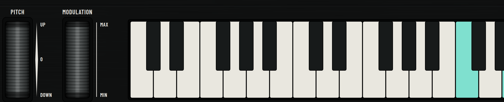

# FM6 Panel

A study project: a browser-based replica of the control panel of a
classic 1983 6-operator FM synthesizer, wired to a custom FM sound engine
built from scratch on the Web Audio API (AudioWorklet). No frameworks, no
prebuilt synth libraries.


## Try it

The whole instrument is also packaged as a **single self-contained HTML
file** — build it with `npm run standalone`, then just double-click
`FM6-synth.html` and open it in Chrome (click once, or press a letter key,
to start audio). Nothing to install.

Or run it from source:

```sh
npm install
npm run dev          # dev server
npm run build        # static build into dist/
npm run preview      # serve the build
npm run standalone   # -> FM6-synth.html (self-contained, opens from file://)
npm test             # 109 unit tests
node scripts/audiocheck.mjs   # headless audio verification (needs `npm run preview`)
```

Everything ships as static files; any static host works.

## What it does

- **Panel** — full mode state machine (PLAY / EDIT / COMPARE / FUNCTION /
  STORE) with a character-ROM-accurate 16×2 LCD and a 2-digit 7-segment
  LED, the complete **155-parameter voice model** with live editing,
  store/compare flows, function parameters, and voice-name entry.
- **Engine** — a 6-operator phase-modulation AudioWorklet covering all
  **32 algorithms**, per-operator envelopes with keyboard level/rate
  scaling, feedback, a 6-waveform LFO with delay/fade, and a pitch EG.
  Parameter-to-engine latency measures ~21 ms.
- **Performance row** — pitch-bend and modulation wheels plus a playable
  5-octave keyboard (click, drag to glide, or use the computer keyboard).
- **Patches** — 32-voice SysEx banks load at boot (`public/rom1a.syx`) or
  by dropping a `.syx` file on the page ("cartridge").



## Controls

Press `?` in the app for the full reference. The computer keyboard plays
`A`–`;` from C3 (`W E T Y U O P` for sharps, Shift for hard velocity); the
on-screen keyboard plays on click and glides when you drag across it.
Digits press the numbered buttons (Shift +10, Alt +20, Alt+Shift+1/2 =
31/32); Enter/Backspace and the up/down arrows are YES/NO; left/right
arrows step parameters; `-`/`=` nudge data entry; Alt+E toggles
EDIT/COMPARE, Alt+F FUNCTION; Space repeats the last button; Escape
returns to PLAY.

## Layout

- `src/panel/` — SVG panel, sliders, membrane buttons, wheels, keyboard,
  LCD and LED renderers. Geometry and silkscreen live in `panelLayout.js`;
  palette in `colors.js`.
- `src/display/` — HD44780-A00 character ROM, 7-segment glyphs, LCD text
  formatting.
- `src/state/` — central store/event bus, panel mode state machine, the
  per-mode button routing tables, voice/function parameter models, SysEx
  banks.
- `src/engine/` — the AudioWorklet FM DSP core (operators, envelopes,
  algorithms, LFO, pitch EG) and its front-end.
- `src/sysex/` — voice bulk-dump codec and factory banks.

The panel draws in a fixed `1920×1160` viewBox and scales uniformly to the
page width; the LCD and LED are canvases mounted into SVG slots via
foreignObject, so they scale with the artwork while keeping their own
pixel grids.

## Notes on fidelity

Several DSP curves (EG timing, LFO speed, modulation index, scaling
slopes) are provisional constants pending the reverse-engineering
reference tables; MIDI in/out is stubbed, not implemented. See
`reference/README.md` for the full status.
