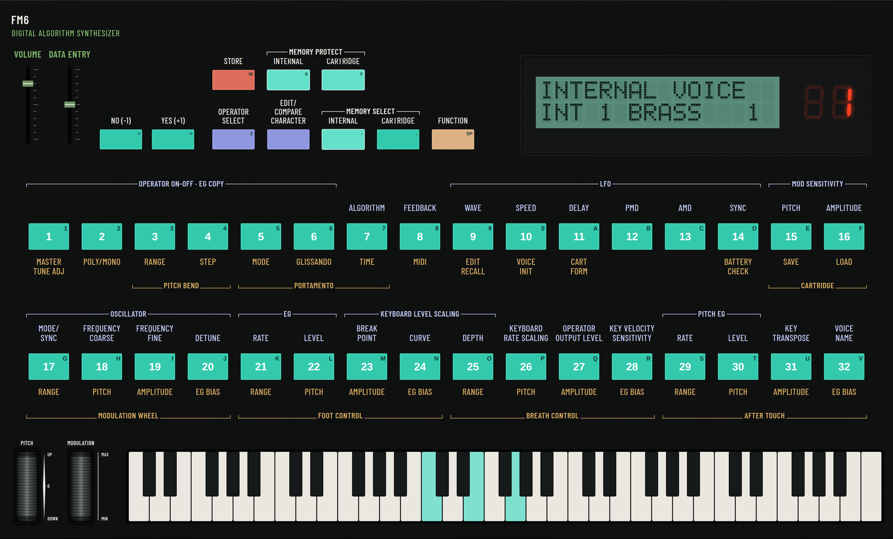
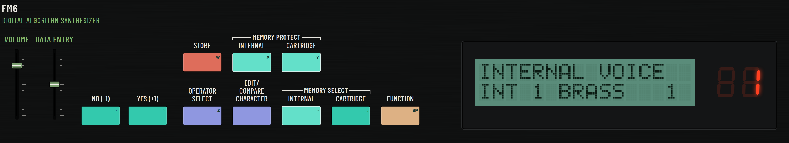
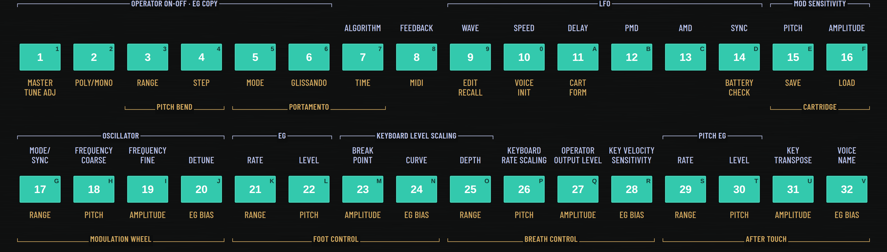
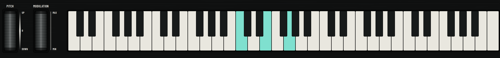

# FM6 — a browser FM synthesizer

A playable, browser-based recreation of the control panel of a classic
1983 6-operator FM synthesizer, driven by a custom FM sound engine built
from scratch with the Web Audio API. No plugins, no install, no account.



## ▶ Play it — just one file

1. **[Download `FM6-synth.html`](FM6-synth.html)** (on that page, click
   **“Download raw file”**).
2. **Double-click it** to open in **Google Chrome**.
3. **Click a key** (or press a letter on your keyboard) — that first click
   starts the sound. Play!

That single file *is* the whole synthesizer — the panel, the sound engine,
the fonts, and 64 factory sounds are all baked in. Nothing else to
download or set up. It runs completely offline, on your computer, in your
browser.

> Chrome is recommended. Most modern browsers work; audio always starts on
> your first click or key press (browsers require that).

## Playing

- **Computer keyboard:** the letter keys `A S D F G H J K L ;` are the
  white keys (from middle C), `W E T Y U O P` the black keys. Hold
  **Shift** for a harder/louder note.
- **On-screen keyboard:** click a key to play it, and **click-and-drag**
  across the keys to glide from note to note.
- Press **`?`** at any time for the full list of shortcuts.

## The panel, zone by zone

**Top — controls & displays.** The VOLUME and DATA ENTRY sliders, the mode
buttons (STORE, MEMORY PROTECT/SELECT, EDIT/COMPARE, FUNCTION…), the green
16×2 text screen, and the red patch-number display.



**Middle — the 32 parameter buttons.** In PLAY mode these choose sounds; in
EDIT and FUNCTION modes they select the parameters printed above (blue) and
below (gold) each button, so you can shape or reprogram the sound.



**Bottom — the performance row.** The **pitch-bend** wheel (springs back to
centre) and the **modulation** wheel (adds vibrato), plus a **5-octave
keyboard**.



## Sounds, and loading more

FM6 comes with **64 factory sounds** built in:

- **32 in the INTERNAL bank** (it powers up on `INT 1 BRASS 1`)
- **32 in the CARTRIDGE bank**

To choose a sound: press **MEMORY SELECT → INTERNAL** or **CARTRIDGE** to
pick the bank, then a **numbered button (1–32)** to load a patch — its name
shows on the green screen.

**Load more sounds:** drag any DX7-format **`.syx`** bank file onto the
page. It loads into the cartridge slot as another 32 sounds (then reach
them via MEMORY SELECT → CARTRIDGE). You can swap in a new file anytime —
thousands of free `.syx` banks exist online, so the sound palette is
effectively unlimited.

---

## For developers

The app is plain HTML/CSS/JavaScript (ES modules) with an AudioWorklet DSP
core — no framework, no runtime dependencies. To run it from source or
change it, grab the code (**Code ▸ Download ZIP**, or `git clone`) and:

```sh
npm install
npm run dev          # live dev server (open the printed localhost URL)
npm run build        # static build into dist/ (host it anywhere)
npm run standalone   # regenerate the one-file FM6-synth.html
npm test             # 109 unit tests
node scripts/audiocheck.mjs   # headless audio checks (needs `npm run preview`)
```

Source map: `src/panel/` (SVG panel, sliders, buttons, wheels, keyboard,
LCD/LED — geometry in `panelLayout.js`, palette in `colors.js`),
`src/state/` (store, mode state machine, 155-parameter voice model, SysEx
banks), `src/engine/` (the AudioWorklet FM DSP core and its front-end),
`src/display/` (HD44780 character ROM, 7-segment glyphs, LCD formatting).
Some DSP curves are provisional constants and MIDI I/O is stubbed; see
`reference/README.md` for the fidelity notes.
